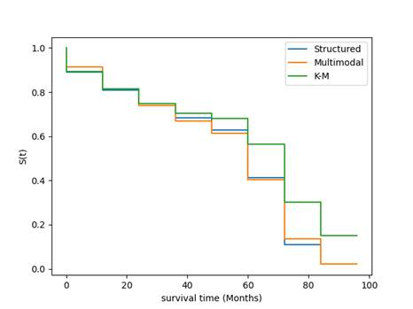
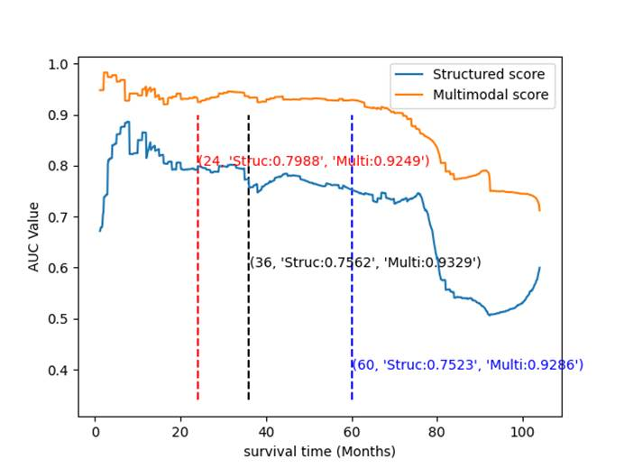
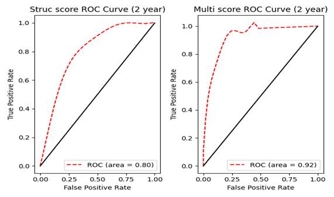
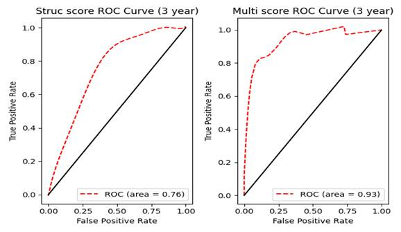
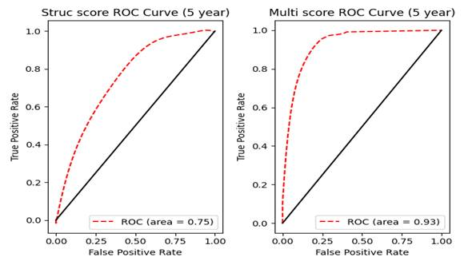

# esophagealcancer

## Health status analysis

### Data Description

本数据集一共313例数据，分为两个部分：第一部分为临床的结构化数据，其中包括44张标签为1的样本，269张标签为0的样本，第二部分为对应的CT医学影像数据，两者是相同任务下不同模态的数据。

### demand

1. 对临床结构化数据进行建模；

2. 提取CT医学影像数据特征；

3. 筛选影像学特征及临床结构化特征；

4. 建立多模态健康预测模型；

### Multimodal Classification 

#### Feature extraction

由于本实验中样本数据量较少，本实验采用了迁移学习方法。本实验中首先利用医生提供勾画CT图像上的病灶区域，截取病灶区域的图像特征，并将图像特征的尺寸规范化至（224，224，3），然后利用CNN模型ResNet50在ImageNet数据集上完成训练，最后删除ResNet50模型最后一层的全连接层，输出病灶区域图像至预训练模型输出embedding作为提取的影像特征。每张CT样本提取后的embedding输出维度为1000。

#### Feature selection

- **T 检验**：T检验是评估两组分类的均值是否在统计学上彼此不同的方法，通过T分布理论来推断差异发生的概率，从而判定两个平均数的差异是否显著。常见的三种T检验如下：(1) 单样本 T 检验；(2) 配对样本 T 检验； (3) 两独立样本 T 检验； 本实验采用方差齐性检验、两独立样本 T 检验作为指标，筛选特征，结果如下：

```
esophagectomy(0=open,1=minimally invasive)、approach（ Ivor Lewis technique=0，McKeown technique=1）、surgery（open Ivor Lewis=1，open McKeown=2，minimally invasive Ivor Lewis =3，minimally invasive McKeown=4）、Tstages、intravascular-cancer-embolus(0=no,1=yes)、nerve-invasion(0=no,1=yes)、CT-836
```

- **LASSO 特征筛选**：套索算法(Least Absolute Shrinkage and Selection Operator, LASSO)是一种嵌入式特征选择方法，通过构造一个惩罚函数得到一个较对精炼的模型，把不重要的特征系数变为 0，以得到关键特征。将T检验筛选后得到的特征输入模型，得到如下特征。

|                                                              | Correlation coefficient |
| ------------------------------------------------------------ | ----------------------- |
| **esophagectomy(0=open,1=minimally invasive)**               | 0.023846                |
| **approach（ Ivor Lewis technique=0，McKeown technique=1）** | 0.035974                |
| **Tstages**                                                  | 0.012397                |
| **intravascular-cancer-embolus(0=no,1=yes)**                 | 0.021465                |
| **nerve-invasion(0=no,1=yes)**                               | 0.045723                |
| **CT-836**                                                   | 0.052672                |

#### Model building

- 数据集切分：采用StratifiedKFold分层采样的方式，将数据集根据标签中不同类别占比切分为8个互斥子集，每次只用其中一个子集作测试集，剩下7份作为训练集。

- 数据处理 - 特征变换：数值变量进行标准化，保持二值变量不变，对类别变量进行实体嵌入

  ```
  数值变量：Tstages、CT-836
  二值变量：无
  类别变量： esophagectomy(0=open,1=minimally invasive)、approach（ Ivor Lewis technique=0，McKeown technique=1）、intravascular-cancer-embolus(0=no,1=yes)、nerve-invasion(0=no,1=yes)
  ```

- 模型评估：本实验分别采用了**逻辑回归模型、线性判别式分析模型，支持向量机模型(SVC)、高斯朴素贝叶斯模型、K近邻模型、随机森林、梯度提升树作为分类器**，进行二分类任务。以roc_auc作为评价指标，进行8折交叉验证评分。

| 模型                | AUC指标 |
| ------------------- | ------- |
| 支持向量机模型(SVM) | 0.810   |
| 随机森林            | 0.806   |
| K近邻模型           | 0.751   |
| 梯度提升树          | 0.736   |

## Survival analysis

### Data Description

本数据集一共290例数据，分为两个部分：第一部分为临床的结构化数据，其中包括146张标签为1的样本，144张标签为0的样本，第二部分为对应的CT医学影像数据，两者是相同任务下不同模态的数据。

### demand

1. 对临床结构化数据进行建模；

2. 提取CT医学影像数据特征；

3. 筛选影像学特征及临床结构化特征；

4. 建立多模态生存预测模型；

### Multimodal survival analysis

#### Feature extraction

由于本实验中样本数据量较少，本实验采用了迁移学习方法。本实验中首先利用医生提供勾画CT图像上的病灶区域，截取病灶区域的图像特征，并将图像特征的尺寸规范化至（224，224，3），然后利用CNN模型ResNet50在ImageNet数据集上完成训练，最后删除ResNet50模型最后一层的全连接层，输出病灶区域图像至预训练模型输出embedding作为提取的影像特征。每张CT样本提取后的embedding输出维度为1000。

#### Feature selection

- **T 检验**：T检验是评估两组分类的均值是否在统计学上彼此不同的方法，通过T分布理论来推断差异发生的概率，从而判定两个平均数的差异是否显著。常见的三种T检验如下：(1) 单样本 T 检验；(2) 配对样本 T 检验； (3) 两独立样本 T 检验； 本实验采用方差齐性检验、两独立样本 T 检验作为指标，筛选特征，结果如下：

```
Tstages、Nstages、left-recurrent-laryngeal-nerve-involvement(0=no,1=yes)、right-recurrent-laryngeal-nerve-involvement(0=no,1=yes)、carina-lymph-node(0=no,1=yes)、paraesophageal-lymph-node(0=no,1=yes)、gastric-lymph-node(0=no,1=yes)、intravascular-cancer-embolus(0=no,1=yes)、nerve-invasion(0=no,1=yes)、differentiation(1=low,2=medium,3=high)、CT-1、CT-29、CT-56、CT-65、CT-74、CT-75、CT-96、CT-166、CT-231、CT-300、CT-310、CT-314、CT-332、CT-392、CT-438、CT-451、CT-522、CT-563、CT-584、CT-641、CT-676、CT-684、CT-695、CT-713、CT-715、CT-723、CT-725、CT-733、CT-767、CT-819、CT-971、CT-988
```

- **LASSO 特征筛选**：套索算法(Least Absolute Shrinkage and Selection Operator, LASSO)是一种嵌入式特征选择方法，通过构造一个惩罚函数得到一个较对精炼的模型，把不重要的特征系数变为 0，以得到关键特征。将T检验筛选后得到的特征输入模型，得到如下特征。

|                                              | Correlation coefficient |
| -------------------------------------------- | ----------------------- |
| **Nstages**                                  | 0. 142484               |
| **gastric-lymph-node(0=no,1=yes)**           | 0. 023458               |
| **intravascular-cancer-embolus(0=no,1=yes)** | 0. 026032               |
| **nerve-invasion(0=no,1=yes)**               | 0. 034684               |
| **differentiation(1=low,2=medium,3=high)**   | -0.021544               |
| **CT-65**                                    | -0.006311               |
| **CT-231**                                   | -0.002264               |
| **CT-392**                                   | -0.026474               |
| **CT-438**                                   | -0.020905               |
| **CT-451**                                   | -0.007632               |
| **CT-522**                                   | -0.006360               |
| **CT-584**                                   | -0.009293               |
| **CT-641**                                   | -0.018247               |
| **CT-695**                                   | 0.033676                |
| **CT-723**                                   | -0.012181               |
| **CT-725**                                   | -0.020516               |
| **CT-733**                                   | 0.037493                |
| **CT-767**                                   | -0.015939               |
| **CT-819**                                   | 0.030780                |
| **CT-971**                                   | -0.101264               |
| **CT-988**                                   | -0.003313               |

####  Model building

- **数据集切分**：取90%数据作为训练数据，10%数据作为测试数据，其中训练数据按照9:1划分为训练数据与测试数据（测试数据、训练数据、验证数据中正负样本等比例）
- **数据处理 - 特征变换**：数值变量进行标准化，保持二值变量不变，对类别变量进行实体嵌入

```
数值变量：
Structured: age
Multimodal：CT-65、CT-231、CT-392、CT-438、CT-451、CT-522、CT-584、CT-641、CT-695、CT-723、CT-725、CT-733、CT-767、CT-819、CT-971、CT-988
二值变量：无
类别变量：
Structured：Nstages、gastric-lymph-node(0=no,1=yes)、right-recurrent-laryngeal-nerve-involvement(0=no,1=yes)、carina-lymph-node(0=no,1=yes)、paraesophageal-lymph-node(0=no,1=yes)、intravascular-cancer-embolus(0=no,1=yes)、left-recurrent-laryngeal-nerve-involvement(0=no,1=yes)
Multimodal：Nstages、gastric-lymph-node(0=no,1=yes)、intravascular-cancer-embolus(0=no,1=yes)、nerve-invasion(0=no,1=yes)、differentiation(1=low,2=medium,3=high)
```

- **数据处理 – 标签转换**：将事件时间离散化以应用于连续时间数据，设置离散化网格大小（等距）为10
- **基于Logistic Hazard模型和实体嵌入的Bi-LSTM网络**：
  - 模型由实体嵌入层、编码层、解码层、Bi-LSTM以及生存网络（MLP）组成
  - Logistic-Hazard方法能够参数化离散风险并优化生存可能性
  - 实体嵌入: 用于将离散值映射到多维空间中，使其中具有相似函数输出的值彼此靠得更近; 用于解决独热编码变量导致的向量稀疏问题
  - 损失函数：由NLLLogistiHazardLoss与编解码器MSELoss组成

- **模型评估指标**：c-index：一致性指数，常用在评价患者预后模型的预测精度中。一般情况下C-index在0.50-0.70为准确度较低：在0.71-0.90之间为准确度中等；而高于0.90则为高准确度。
- 模型结果

|         | 结构化数据 | 多模态数据 |
| ------- | ---------- | ---------- |
| c-index | `0.4691`   | `0.7160`   |











